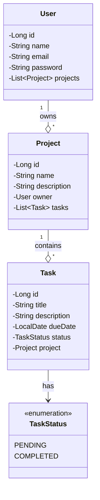

# Task Manager - Mini Project

This is A full-stack application for managing tasks and projects.

---

## Tools Used

| Layer    | Technology                          |
|----------|-------------------------------------|
| Backend  | Java 17, Spring Boot 3.x, Spring Security, JWT |
| Frontend | React 18, Fetch API, React Router, Tailwind CSS |
| Database | PostgreSQL 16                       |
| Build    | Maven (Backend), npm + Vite (Frontend) |

---


## Class Diagram


---
## Database Setup

### 1. Install PostgreSQL

#### Ubuntu/Debian:
```bash
sudo apt update
sudo apt install postgresql postgresql-contrib
sudo systemctl start postgresql
sudo systemctl enable postgresql
```

### 2. Create Database and User:
```bash
sudo -u postgres psql
```

```sql
CREATE DATABASE taskmanager;
CREATE USER taskuser WITH PASSWORD 'taskpassword1234';
GRANT ALL PRIVILEGES ON DATABASE taskmanager TO taskuser;
\c taskmanager
GRANT ALL ON SCHEMA public TO taskuser;
\q
```

---

## How to Run Backend

1. Firstly navigate to the backend folder:
```bash
cd backend-task-manager
```

2. Run the application:
```bash
./mvnw spring-boot:run
```

The API will be available at `http://localhost:8080`

---

## How to Run Frontend

1. Navigate to the frontend folder:
```bash
cd frontend-task-manager
```

2. Install dependencies:
```bash
npm install
```

3. Run the development server:
```bash
npm run dev
```

The app will be available at `http://localhost:5173`

---

## Authentication

- As a User you must register via the `/register` page first
- The Password must be at least 8 characters
- JWT token is used for authentication

---

## API Endpoints

| Method | Endpoint | Description |
|--------|----------|-------------|
| POST | `/api/auth/register` | User registration |
| POST | `/api/auth/login` | User login |
| GET | `/api/projects` | List user projects |
| POST | `/api/projects` | Create project |
| GET | `/api/projects/{id}` | Get project details |
| GET | `/api/projects/{id}/tasks` | List project tasks |
| POST | `/api/projects/{id}/tasks` | Create task |
| PUT | `/api/projects/{id}/tasks/{taskId}/complete` | Mark task complete |
| DELETE | `/api/projects/{id}/tasks/{taskId}` | Delete task |
